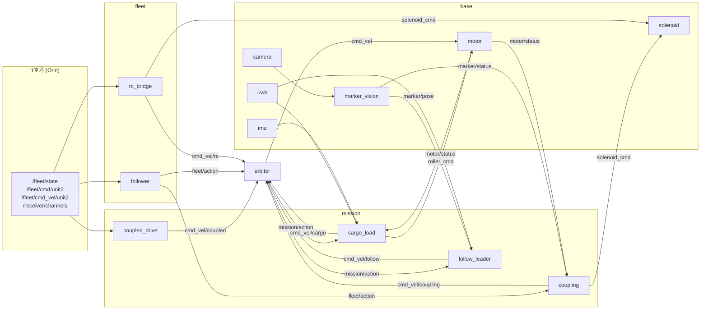
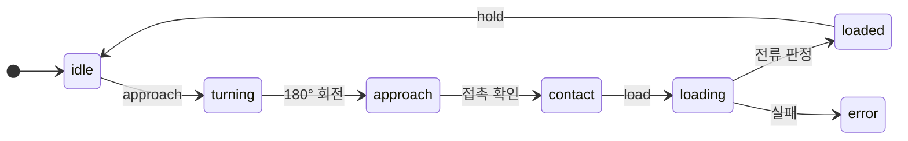
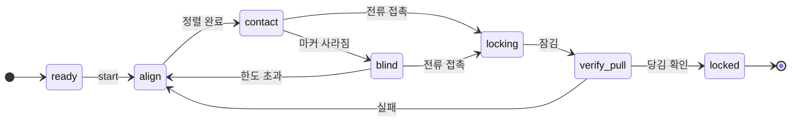

# KIro_review_Pi

**MARS 2호기** — 2026 육군참모총장배 국방로봇경진대회에 출전한 무한궤도 로봇 2호기의
라즈베리파이 ROS 2 워크스페이스. 대회 종료 시점(2026-09-04) 코드 스냅샷이다.

2호기는 선도 로봇인 1호기(Jetson Orin, 별도 저장소)의 지휘를 받는 추종·보조 로봇이다.
스스로 판단하지 않고 1호기 뒤의 ArUco 마커를 따라가며, **여름 구간에서는 물자 적재**,
**겨울 구간에서는 1호기와 기계적으로 결합**해 함께 주행한다.

> 팀 운영 정책 문서(`AGENTS.md`)와 개발용 측정 도구(`test_basic/`)는 포함하지 않았다.
> 문서와 `TODO.md` 에 남아 있는 해당 언급은 대회 당시의 기록이다.

---

## 목차

1. [하드웨어](#하드웨어)
2. [폴더 구조](#폴더-구조)
3. [패키지와 노드](#패키지와-노드)
4. [전체 동작](#전체-동작)
5. [주행 모드](#주행-모드)
6. [미션별 동작](#미션별-동작)
7. [실행](#실행)
8. [설정 파일](#설정-파일)
9. [테스트](#테스트)
10. [알려진 한계](#알려진-한계)
11. [더 읽을 문서](#더-읽을-문서)

---

## 하드웨어

| 구성 | 부품 | 담당 노드 |
|---|---|---|
| 제어기 | Raspberry Pi 5, Ubuntu 24.04, ROS 2 Jazzy | — |
| 주행 | 좌·우 무한궤도 모터 2개 (CAN ID 1·2, ODrive CANSimple) | `motor` |
| 컨베이어 | 롤러 모터 1개 (CAN ID 3) | `motor` |
| CAN | PCAN-USB (`can0`, 1 Mbps) | `motor` |
| 카메라 | Raspberry Pi Camera (IMX708), 1280×720 15fps, 캘리브레이션 완료 | `camera` |
| 방위 | BNO086 IMU (I2C, 지자기 제외 모드) | `imu` |
| 거리 | DWM1001 UWB 태그 (USB 시리얼) | `uwb` |
| 결합 잠금 | 솔레노이드 + 릴레이 (GPIO23, **무통전 = 잠금**) | `solenoid` |
| 조종기 | RC 수신기 — 1호기에 달려 있고 채널 값만 넘겨받음 | `rc_bridge` |

배선·결선값·실측 기록은 [HARDWARE.md](HARDWARE.md).

---

## 폴더 구조

```
.
├── README.md                          이 문서
├── HARDWARE.md                        배선표, 결선값, 실측 기록
├── RUNBOOK.md                         단계별 실행·시험 절차
├── COMMUNICATION_PROTOCOL_UNIT2.md    1호기↔2호기 통신 규약 (토픽·JSON 필드)
├── TODO.md                            대회 당시 미구현·미검증 항목 기록
├── docs/                              노드 하나하나의 상세 문서 (구독/발행/연결)
│
└── src/
    ├── base/                ── 1층: 하드웨어 드라이버
    │   ├── base/
    │   │   ├── motor.py              CAN 모터·롤러 제어, 전류·엔코더 조회
    │   │   ├── camera.py             카메라 → 압축 영상 토픽 + MJPEG(:8000)
    │   │   ├── marker_vision.py      ArUco 검출 노드 (필터·pose 발행)
    │   │   ├── aruco_tracker.py      검출·solvePnP 순수 로직 (노드 아님)
    │   │   ├── imu.py                BNO086 방위각
    │   │   ├── uwb.py                DWM1001 거리
    │   │   ├── solenoid.py           결합 잠금 릴레이
    │   │   ├── calibrate_camera.py   카메라 캘리브레이션 도구 (launch 미포함)
    │   │   └── imu_aruco_360_test.py IMU 영점 검증 도구 (launch 미포함)
    │   ├── config/                   각 노드 yaml
    │   └── test/
    │
    ├── fleet/               ── 2층: 1호기와의 통신
    │   ├── fleet/
    │   │   ├── protocol.py           통신 규약 상수·검증 (공용 모듈)
    │   │   ├── follower.py           1호기 명령 수신, 감시(watchdog), 상태 보고
    │   │   ├── rc_bridge.py          RC 채널 → 주행·컨베이어·솔레노이드·모드
    │   │   └── fake_leader.py        1호기 없이 벤치 시험용 가짜 리더
    │   ├── config/
    │   └── test/
    │
    ├── mission/             ── 3층: 미션 (인식 + 제어)
    │   ├── mission/
    │   │   ├── winter/follow_leader.py  1호기 추종 (전 구간 공통)
    │   │   ├── summer/cargo_load.py     여름 물자 적재
    │   │   ├── common/coupling.py       자동 결합 상태기계
    │   │   └── common/coupled_drive.py  결합 후 1호기 속도 복제 주행
    │   ├── config/
    │   └── test/
    │
    ├── drive/               ── 4층: 주행 중재
    │   ├── drive/
    │   │   ├── arbiter.py            모드 소유 + 최종 속도 명령 하나 선택
    │   │   ├── manual.py             키보드 조종 (터미널 전용)
    │   │   ├── test_console.py       호기 로컬 시험 화면 (:5000)
    │   │   └── templates/test_console.html
    │   ├── config/
    │   └── test/
    │
    ├── mars_console/        ── 5층: 운용 PC 화면 (:5100)
    │   ├── mars_console/console.py   1·2호기 동시 운용 웹 콘솔
    │   └── mars_console/templates/
    │
    └── mars_launch/         ── 실행 조립
        ├── launch/
        │   ├── robot.launch.py       본체 13개 노드
        │   ├── test_drive.launch.py  본체 + 시험 화면
        │   ├── manual.launch.py      정비용 단독 수동 주행
        │   ├── web_manual.launch.py  1호기 없는 벤치 시험 (도메인 77)
        │   └── manual_drive.launch.py 키보드 수동 주행 격리 시험 (도메인 77)
        └── config/unit2.yaml
```

---

## 패키지와 노드

모든 노드는 **`/unit2` 네임스페이스** 아래에서 돈다. 1호기와 `cmd_vel`·`motor/status`
같은 토픽 이름이 겹치기 때문이다. 코드 안의 토픽은 전부 상대 이름이고,
1호기와 공유하는 `/fleet/*`·`/receiver/channels` 만 절대 경로다.

### base — 하드웨어

| 노드 | 역할 | 구독 | 발행 |
|---|---|---|---|
| `motor` | 최종 속도(Twist)를 좌우 모터 속도로 나눠 CAN 전송. 가감속 제한, 명령 0.5초 끊기면 정지. Iq 전류·엔코더를 RTR로 주기 조회. CAN 어댑터가 빠졌다 붙으면 자동 재연결 | `cmd_vel`, `roller_cmd` | `motor/status` |
| `camera` | 카메라 영상을 JPEG로 발행하고 MJPEG 스트림(:8000)도 연다. 카메라가 없으면 더미 영상 | — | `camera/image/compressed` |
| `marker_vision` | ArUco(`DICT_4X4_50`, 40mm) 검출과 solvePnP 자세 추정. 여러 프레임 판정으로 검출/소실을 필터링. 저대비 대비 CLAHE·히스토그램 평활화 폴백 | `camera/image/compressed`, `marker/enable` | `marker/status`, `marker/pose`, `vision/image/compressed` |
| `imu` | BNO086 쿼터니언 → 방위각. 지자기 편향 때문에 지자기 제외 모드 사용 | — | `imu/heading_deg`, `imu/status` |
| `uwb` | DWM1001 거리 스트림 파싱, 끊기면 재연결 | — | `uwb/distance_mm`, `uwb/status` |
| `solenoid` | GPIO 릴레이. 시작·종료 시 항상 잠금(무통전). 해제는 5초 뒤 자동 재잠금(발열 방지) | `solenoid_cmd` | `solenoid_status` |

### fleet — 1호기 통신

| 노드 | 역할 |
|---|---|
| `follower` | `/fleet/cmd/unit2` 명령을 검증(`t`·`seq` 필수, 중복 `seq` 무시)해 `fleet/action`으로 넘긴다. 명령·상태가 2.5초 끊기면 `safety/stop`. 5Hz로 `/fleet/status/unit2` 보고. 여름 외 구간에서는 `/fleet/state`만 와도 자동으로 추종 |
| `rc_bridge` | 1호기가 넘겨주는 RC 채널을 해석. CH7 호기 선택, CH8 정지/재생, CH1·2 주행, CH5 속도 배율, CH9 컨베이어, CH3 솔레노이드, CH10 자동/수동 전환. 웹의 "조종 방식" 토글로 켜고 끈다 |
| `fake_leader` | `/fleet/state`를 흉내 내는 벤치 시험용 노드. **실물 1호기와 같은 도메인에서 켜면 안 된다** |

### mission — 미션

| 노드 | 역할 |
|---|---|
| `follow_leader` | 마커와 UWB로 1호기와의 거리·방향을 맞춘다 |
| `cargo_load` | 여름 적재 순서 진행 + HSV 적색 물자 검출 |
| `coupling` | 정렬 → 접근 → 접촉 → 잠금 → 당김 검증의 결합 상태기계 |
| `coupled_drive` | 결합 완료 후 1호기가 보내는 속도를 그대로 복제 |

### drive — 중재

| 노드 | 역할 |
|---|---|
| `arbiter` | 주행 모드를 소유하고, 여러 후보 속도(`cmd_vel/*`) 중 **하나만** 골라 `cmd_vel`로 낸다. 1호기 명령과 UI 요청 중 모드에 맞는 것을 `mission/action`으로 확정해 미션 노드에 넘긴다 |
| `test_console` | 호기 안에서 뜨는 시험 화면(:5000). 카메라, 상태, 결합 시작·취소·해제, 비상 정지 |
| `manual` | 키보드 WASD 조종. launch에 넣지 않고 터미널에서 직접 실행 |

---

## 전체 동작



**속도 명령은 반드시 arbiter 하나를 거쳐 모터로 간다.** 각 미션 노드는 자기
후보 속도만 계속 내고, arbiter가 모드에 따라 그중 하나를 고른다.

### arbiter의 선택 순서

1. **안전 정지** — `safety/emergency_stop`, `safety/stop` 중 하나라도 켜져 있으면 0
2. **결합 진행 중** — `coupling`이 활성이거나 `locking`·`error` 단계면 결합 속도가 모드보다 우선
3. **모드별 소스** — 아래 표
4. **소스 시간 초과** — 고른 소스가 0.5초 동안 새 값을 안 보내면 0

---

## 주행 모드

`drive/mode_cmd`(String)로 전환한다. 시작은 항상 `idle`이다.

| 모드 | 주행 소스 | 미션 명령 출처 | 진입 조건 |
|---|---|---|---|
| `idle` | 없음 (정지) | — | — |
| `manual` | `cmd_vel/manual` (웹·키보드) | — | — |
| `rc` | `cmd_vel/rc` (조종기) | — | — |
| `auto` | 미션 노드 | `mission/request` (웹 UI) | — |
| `follow` | 추종, 화물 명령이 오면 적재 | `/fleet/cmd/unit2` (1호기) | `/fleet/state` 수신 중 |
| `coupled` | `cmd_vel/coupled` | 1호기 속도 복제 | `/fleet/state` 수신 중. **결합 완료 시 자동 진입** |

`follow`·`coupled`에서 `/fleet/state`가 2.5초 끊기면 스스로 `idle`로 내려온다.

---

## 미션별 동작

### 추종 — `follow_leader` (전 구간)

1호기 뒤 ArUco 마커(ID 1)를 보며 일정 거리를 유지한다.

- **거리**: UWB가 있으면 UWB, 없으면 마커 solvePnP 거리(지수이동평균)를 쓴다.
  목표 거리보다 멀 때만 비례 제어로 전진한다.
- **방향**: `조향 = -k_angular × 좌우 오프셋 + k_yaw × 1호기 방향`
- **1호기 방향**은 마커 자세의 `pitch` 성분이다. 마커판이 로봇 뒤에 세로로 붙어 있어,
  로봇이 제자리에서 도는 회전이 마커 좌표계에서는 Y축(pitch) 회전으로 나타난다
  (30° 회전 시 pitch -27.7°, yaw -0.26° 실측).

### 여름 물자 적재 — `cargo_load`

1호기가 액션을 하나씩 보내며 진행한다.



- **회전**: `approach`를 받으면 IMU 방위각으로 180° 돌아 물자 쪽을 등진다.
- **접촉 확인**: UWB 거리가 가깝고, 1호기가 자기 전류로 판정한 접촉 결과가 3번 연속 오면 `contact`.
- **적재 중**: 저속 후진으로 물자를 밀면서 롤러를 돌린다.
- **실패**: 시간 초과, 전류 값 끊김, 안전 정지 중 하나면 `error`.
- **완료 판정**: 주행 모터(ID 1·2) 전류가 `unit2_load_high_current_a` 이상으로
  올랐다가 `unit2_load_low_current_a` 아래로 떨어져 유지되면 완료. 1호기가 자기 전류로
  하락을 판정해 보내 줘도 완료로 본다. 롤러 전류는 쓰지 않는다.
- **적색 검출**: 카메라 영상에서 HSV 적색 영역을 5Hz로 찾아 `cargo/red_detected`로 알린다.
- **수동 컨베이어**: 미션이 멈춰 있을 때는 웹·RC의 컨베이어 입력(`roller_manual_cmd`)을 받는다.

### 겨울 자동 결합 — `coupling`

1호기 뒤로 다가가 결합부를 물리고 솔레노이드로 잠근다.



1. **정렬(`align`)** — 제자리 회전만 한다. 오차는 마커까지의 **방위각**
   `atan2(x, z)`이고, **새 마커 표본이 왔을 때만** 조향을 다시 계산한다(제어 주기가
   카메라보다 빨라서 같은 값에 두 번 반응하면 진동한다). 허용치 안에 들어오면 조향을 0으로 끊는다.
2. **접근(`contact`)** — 방위각 조향을 유지하며 전진한다. 마커가 커질수록 속도를 줄인다.
3. **블라인드 접촉** — 너무 가까워져 마커가 사라지면 그 순간부터 직진하며
   **모터 전류로 접촉을 감지**한다. 최대 거리·시간 한도가 있다.
4. **잠금(`locking`)** — 솔레노이드에 잠금 신호를 보내고 상태를 확인한다.
5. **당김 검증(`verify_pull`)** — 천천히 후진해 전류가 오르면(=1호기가 끌려옴) 결합 완료.
   실패해도 **솔레노이드를 풀지 않고** 결합을 다시 돌린다.
6. **완료(`locked`)** — arbiter가 주행 모드를 자동으로 `coupled`로 올린다.

**솔레노이드는 기계적으로 잠긴다.** 해제는 사람이 명시적으로 누르는
`coupling/cmd`의 `unlock`(시험 화면의 "결합 해제" 버튼)뿐이다. `cancel`은 진행만 멈추고 잠금은 유지한다.

| `coupling/cmd` | 동작 |
|---|---|
| `{"action":"start"}` | 결합 시작 (조건이 갖춰질 때까지 대기했다가 시작) |
| `{"action":"cancel"}` | 진행 중인 결합만 중단 |
| `{"action":"unlock"}` | 솔레노이드 해제 |
| `{"action":"recapture"}` | 기준 자세 다시 측정 |

### 결합 후 협조 주행 — `coupled_drive`

결합하면 결합 로드가 거리를 물리적으로 고정하므로, 추종(거리 제어)을 쓰면 로드와 싸운다.
그래서 **1호기가 자기 구동 명령과 같은 루프에서 50Hz로 보내는 속도**
(`/fleet/cmd_vel/unit2`)를 그대로 복제한다.

- 강체 결합이라 각속도도 같이 복제한다(`follow_angular`).
- 결합 방향에 따라 부호가 뒤집힐 수 있어 `linear_sign`·`angular_sign`으로 보정한다.
- `locked`가 아니거나 1호기 속도가 0.5초 끊기면 0을 낸다.

---

## 실행

### 빌드

```bash
source /opt/ros/jazzy/setup.bash
colcon build --symlink-install
source install/setup.bash
export ROS_DOMAIN_ID=10
```

1·2호기가 서로 보이려면 둘 다 `ROS_DOMAIN_ID=10`이어야 한다. 카메라(`picamera2`)는
`/usr/local/lib/python3/dist-packages` 경로가 필요하며 launch가 자동으로 넣어 준다.

### launch 파일

| 명령 | 뜨는 것 | 용도 |
|---|---|---|
| `ros2 launch mars_launch robot.launch.py` | 본체 13개 노드 | 실전 |
| `ros2 launch mars_launch test_drive.launch.py season:=winter` | 본체 + 시험 화면 `:5000` | 실물 시험 |
| `ros2 launch mars_launch manual.launch.py` | 모터 + arbiter (`console:=true`면 카메라·시험 화면 추가) | 정비 |
| `ros2 launch mars_launch web_manual.launch.py` | 모터·카메라·추종·적재·솔레노이드 + 가짜 리더, **도메인 77** | 1호기 없는 벤치 시험 (결합 노드 없음) |
| `ros2 launch mars_launch manual_drive.launch.py` | 키보드 + arbiter + 모터, **도메인 77** | 격리 수동 주행 |

`season` 인자는 표시용이다. 계절과 무관하게 같은 노드가 뜬다.

### 자주 쓰는 명령

```bash
# 결합 시작 (또는 시험 화면 http://<호기IP>:5000 의 버튼)
ros2 topic pub --once /unit2/coupling/cmd std_msgs/msg/String "data: '{\"action\":\"start\"}'"

# 결합 진행 단계 보기
ros2 topic echo /unit2/mission/coupling/status --field phase

# 주행 모드 전환
ros2 topic pub --once /unit2/drive/mode_cmd std_msgs/msg/String "data: 'manual'"

# 키보드 조종 (launch 와 별도 터미널)
ros2 run drive manual --ros-args -r __ns:=/unit2

# 좌·우·롤러 모터 CAN 응답 확인 (021 / 041 / 061 heartbeat)
timeout 5 candump can0,021:7FF,041:7FF,061:7FF
```

1호기 명령(`/fleet/cmd/unit2`)을 손으로 보낼 때는 `t`(타임스탬프)와 `seq`가 **필수**다.
빠지면 `follower`가 거부한다.

---

## 설정 파일

게인·임계값 같은 숫자는 문서가 아니라 **yaml이 최신 출처**다. 모든 yaml의 노드 키는
`/**/노드이름:` 형식이어야 네임스페이스가 붙은 노드와 매칭된다. `motor:`처럼 쓰면
**에러 없이 무시되고 코드 기본값이 쓰인다.**

| 파일 | 주요 내용 |
|---|---|
| `base/config/motor.yaml` | CAN ID, 속도 배율 `vel_scale`, 가감속 제한, 좌측 반전, 전류 조회 주기 |
| `base/config/camera.yaml` | 해상도, 프레임레이트, 회전 |
| `base/config/marker.yaml` | ArUco 딕셔너리·ID·크기, **카메라 캘리브레이션 행렬**, 검출 필터 |
| `base/config/imu.yaml` / `uwb.yaml` / `solenoid.yaml` | I2C 주소·지자기 사용, 시리얼 포트, GPIO 핀·자동 재잠금 시간 |
| `drive/config/arbiter.yaml` | 소스 시간 초과, 시작 모드, 키보드·시험 화면 설정 |
| `fleet/config/follower.yaml` / `rc_bridge.yaml` | 명령 감시 시간, RC 채널 매핑·임계값 |
| `mission/config/follow.yaml` | 목표 거리, 거리·좌우·yaw 게인 |
| `mission/config/cargo.yaml` | 회전 각도, 적재 속도, **적재 완료 전류 high/low**, 적색 HSV 범위 |
| `mission/config/coupling.yaml` | 정렬 허용치·게인, 접근 속도, **접촉·당김 전류 기준**, 블라인드 한도 |
| `mission/config/coupled.yaml` | 복제 부호, 각속도 복제 여부, 속도 상한 |

**속도와 전류 기준은 짝이다.** 접근 속도나 `vel_scale`을 바꾸면 실제 주행 속도가 달라져
접촉 순간의 전류도 달라지므로, 전류 기준을 그 속도에서 다시 재야 한다.

| 기준 | 값 | 잰 속도 |
|---|---|---|
| 결합 전진 접촉 `contact_current_threshold_a` | 1.2 A | `contact_speed_mps` 0.10 m/s |
| 결합 후진 당김 `verify_current_threshold_a` | 1.2 A | `verify_pull_speed_mps` -0.08 m/s |
| 적재 완료 high / low | 1.3 / 1.0 A (임시값) | `load_speed_mps` -0.1 m/s |

---

## 테스트

```bash
source install/setup.bash
python3 -m pytest src -q --ignore-glob='*launch*'
```

`launch` 파일 이름에 `test_`가 들어 있어 pytest가 테스트로 오인하므로 제외한다.
하드웨어 없이 도는 단위 테스트 169개(스냅샷 시점 전부 통과)로 중재 우선순위, 결합 상태 전이,
적재 순서, 통신 검증, RC 채널 해석 등을 확인한다.

---

## 알려진 한계

대회 이후 코드를 다시 읽으며 확인한 문제다. 스냅샷에는 **고치지 않은 채로** 들어 있다.

| # | 문제 | 영향 |
|---|---|---|
| 1 | 결합 완료(`locked`) 시 `coupled`로 자동 승격하는데, `/fleet/state`가 없으면 곧바로 `idle`로 강등돼 **매 틱 모드가 뒤집힌다** (재현: 6틱에 12번) | 1호기 없는 시험에서 결합 후 정지·로그 폭주 |
| 2 | `coupling`이 `fleet/action`을 직접 구독해 arbiter의 모드 게이트를 우회한다 | `manual`·`rc` 조종 중에도 1호기의 `couple` 명령이 조종권을 가져감 |
| 3 | `marker.yaml`의 소실 판정 표본 수(`lost_min_samples: 6`)가 판정 창(0.35초, 15fps)에 들어올 수 있는 최대치(5)보다 커서, 한번 잡힌 마커가 사라져도 `detected`가 계속 참으로 남는다 | 결합은 `marker_disappear_confirm_s: 0.0` 덕분에 동작 |
| 4 | `marker.yaml`의 `equalize_primary: true`는 저대비 시험 장면에 맞춘 값으로, 1호기 실물 섀시 앞에서는 오히려 검출을 실패시킨 기록이 있다 | 조명·배경에 따라 검출률 저하 |
| 5 | `motor`의 초기화가 모터 응답을 확인하지 않아, 한쪽 모터가 CAN에서 빠져 있어도 `Motors initialized`로 기록된다 | 한쪽 궤도만 돌아 로봇이 한쪽을 축으로 스윙 |
| 6 | 적재 `approach → contact` 전환은 1호기 상태(`cargo_contact_detected`)가 있어야 해서, 2호기 단독으로는 회전 단계까지만 진행된다 | 벤치 시험 제약 |
| 7 | 결합 대각선 보정(yaw)은 넣지 않았다. 대회 중 시도한 구현이 로봇 회전과 무관한 축(`yaw_deg`)을 써서 제외했으며, 넣는다면 추종처럼 `pitch` 성분을 써야 한다 | 비스듬히 접근한 경우 대각선으로 붙을 수 있음 |
| 8 | `coupled_drive`의 `linear_sign`·`angular_sign`, `follow_leader`의 `k_yaw` 부호는 실물로 끝까지 검증되지 않았다 | 부호가 틀리면 반대로 움직임 |

대회 당시 기록된 나머지 미구현·미검증 항목은 [TODO.md](TODO.md)에 있다.

---

## 더 읽을 문서

| 문서 | 내용 |
|---|---|
| [docs/README.md](docs/README.md) | 노드별 상세 문서 목차 (구독·발행·연결·구현 상태) |
| [COMMUNICATION_PROTOCOL_UNIT2.md](COMMUNICATION_PROTOCOL_UNIT2.md) | 1호기↔2호기 통신 토픽과 JSON 필드 |
| [HARDWARE.md](HARDWARE.md) | 배선·결선값·실측 기록 |
| [RUNBOOK.md](RUNBOOK.md) | 단계별 실행·시험 절차와 기대값 |
| [TODO.md](TODO.md) | 대회 당시 미구현·미검증 항목과 시행착오 기록 |
